# 3FloorElevator
# Authors
- Elijah Berberette 
- Wesley Hudson 

# Introduction 
Each semester, ECE 351 students complete a group class project. For our project, we decided to  design a three-floor elevator. We decided to create an elevator because interacting with hardware  components using the BASYS 3 is a topic that is commonly covered in most FPGA classes. This served  as the opportunity to understand how hardware components understand digital signals sent from the  BASYS 3. This project also allowed us to work on an elevator at a proof-of-concept scale, making it  easier to purchase all the required parts and materials needed to understand how elevators work. Overall,  this project serves as an illustration of how an elevator would work at a very small scale. 
Background: related work, motivation, the basic idea 
The objective of our project was to design a three-floor elevator with basic functionality using the  BASYS3 board. We set out to implement 4-key features following a 6-step iterative process. This process  was intended to allow us to create a finished prototype early in the development process. Creating an  early prototype prevented issues with ordering parts and determining if parts would work correctly. The  features and steps to our design process are shown below: 
Features:  
- The elevator uses the BASYS3 board as the digital controller 
- The movement and floor are shown on LEDs 
- There is a motor that lifts and lowers the elevator 
- The elevator stops automatically at each floor 

# Procedure/Method  
1. Research the intended hardware and software needed to implement the overall objective
2. Decide which features are necessary and add/delete accordingly  
3. Set milestones for each of the features in a sequential order to prevent overlap
4. Document each feature completed and the completion process  
5. Test each of the components individually then as a complete system  
6. Review documentation and complete final assessments on the system

# Design details 
We began developing our elevator by creating a state machine for how the elevator should  operate. First, we created a state for when the elevator is stationary, and no inputs have been received.  This is the equivalent of the elevator starting on the first floor. Next, we created a state for when the  elevator is on floors 2 and 3. Initially, in each of these states, we focused strictly on outputting the floor that the elevator is currently on and what direction the elevator is moving on the 7-segment display. This would allow us to see the elevator go through each of the states. After controlling the LEDs for each of the floors, we focused on  implementing a way to  show that the elevator is  in motion. This required  four new additional states in our state machine. We designed two states for moving from one floor to one of the other two floors that  are offered. For example, if the elevator is on the first floor, and we want the elevator to move to the third  floor, we push the pushbutton for the third floor (PB-3 in Figure 1), and this will move the state machine from F1 to MF3 (Figure 1). This will turn the motor into the forward position (“01”) and the elevator will  move until it receives a signal from LS-3 (Figure 1), then it will change states from MF3 to F3 and the  motor will stop moving. Once we established how to go upwards, we designed the other two states to take  the floor states to lower floors offer. 

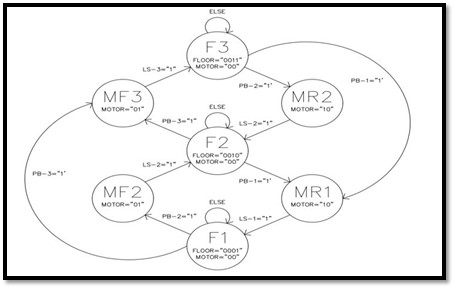

For our initial state machine, arriving on a floor was indicated by clicking a button. Using a button input allowed us to illustrate how arriving at a particular floor would push the state machine into the floor state that the elevator is traveling to. Completing the state machine with the appropriate outputs to the 7- segment display made it possible to perform software and logic testing on how our elevator would work once we received the necessary hardware. We decided to immediately perform experimental testing over simulation testing for this project. This was so we could see the 7-segment display updating through basic scenarios for what an elevator should do. 

The testing procedure for moving from floor one to floor two is illustrated in Figure 2. Essentially, we begin in the state for the first floor. This means we output an ‘F’ for “floor,” the floor  number, and that the elevator is stationary, indicated by an ‘S.’ Next, we click the button used to indicate that we would like to move to floor two. This pushes the state machine into the motor state for moving up to floor two. After 10-20 seconds, we clicked our simulated limit switch button to tell the state machine that it has arrived at floor two. This pushes the elevator into  the state for the second floor, updating the 7-Segment display appropriately. 

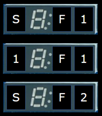

Successfully testing the logic allowed us to move to part two of the second step in our iterative  process where we focused on finding hardware components for our elevator. This process started by taking a motor and motor driver from the Arduino project starter kit. Studying the datasheet for the ULN2003 Stepper Driver Module gave us the required information to turn the stepper motor designed for this particular driver. 

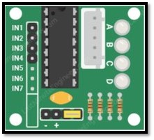

In the datasheet, we found that the Stepper Driver Modules require 5V. This was a problem, considering the BASYS 3 only outputs 3.3V. So, we decided to take the Arduino that was  included in the kit and treat it as a power supply. Next, we focused on figuring out what input the driver was expecting for  each of the input pins. We were able to determine that the input to indicate that we are sending a digital ‘1’ to the driver. During the process of attaching  a wire from the BASYS 3 to the driver, we were able to find out that supplying voltage also turns the  corresponding light on. Finding this out was crucial for the debugging process because we were able to  determine if our code was failing or our wiring. 

After managing to send a ‘0’ or ‘1’ to the system to turn each of the lights on, we needed to  establish a way to send bits to the motor driver in a way that that causes the motor to turn. We found  on another datasheet that it is common to follow an AB->BC->CD->AD pattern when attempting to spin the motor. Essentially, sending a voltage to each of these pins chronologically and repeatedly turns the coils inside the motor on and off in a pattern that rotates the motor. At first, we used the 100 MHz clock that the BASYS 3 board offers to send the digital signals out. Using the pattern  described above caused the motor to become hot and start shaking. This was a good sign because we were able to identify that the motor is receiving the inputs. One major function that the motor was not producing was movement. We were initially  very unsure about why the motor was not working and even blamed it on the idea that these components would not work for the BASYS3, but after another look at  the datasheet, we found that the driver is expecting inputs at a frequency of 100 Hz, not 100 MHz. Discovering this made the solution very simple, we needed a clock divider.  

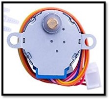

We created the clock divider for this project using the CDiv file that was supplied in ECE 256 and  used in many of the labs. We determined the equation for creating a 100 Hz clock was 100,000,000(1/2) ^x = 100 Hz. Using this formula, we found that replacing the time constant with the value 20 would give  us a clock running at about 95.36 Hz. Outputting each of the voltages with the new clock caused the motor to begin turning counterclockwise at a slow rate. Establishing that the motor could go forwards  gave us the idea that reversing the input pattern would also reverse the motor. This theory proved to be  correct and allowed us to turn the motor counterclockwise.  

Now that we had a working initial state machine and hardware, it was time to begin merging the two. First, we established a way for the motor to work on our initial state machine. Basically, the motor  would move when the user clicks a button and stop when the user hits the simulated limit switch. Next,  we determined a way to move the motor in specific directions when the user clicks a floor above or  below them. This process was easy because our initial state machine handled the output to the 7- Segment display, leaving only motor functionality to tackle. 

After the motor moved properly with simulated limit switches it was time to implement a permanent solution. Removing the simulated limit switches was intended to be done through actual limit switches, but we were unable to get the limit switches to work at all. Instead, we decided to use  counters to tell the motor to turn off when the elevator reaches a certain floor. Discovering how long to  wait before the elevator reached a particular point was based on trial-and-error and observation. The  information describing this process can be found in the Experimental Section of this paper. 

The team finalized the project by creating the structure of the elevator shown below in Figure 9 the appendix. The team designed the elevator with 4 main supports to hold each of the walls in place. Each main support is drilled directly into the baseboard providing stability to the overall system. The top  serves as the housing for the motor and driver. A separate piece of wood, not displayed in the image, sits on top of the elevator which holds the Basys 3 and some additional wiring. Combining our structure  and hardware produced what we presented as our final elevator. 

# Experimental results 
As mentioned above, our first experiments were testing the initial state machine to see if it  operated as intended, we uploaded the state machine code onto the Basys 3 and used the 4 buttons that we  programed to walk it through each state of the machine and checked the outputs that displayed on the 7- segment to make sure it was working correctly. Then our next step was to make sure our hardware was working so we created a test code for the motor using the stepper motor datasheet to find the correct  output and uploaded it to the Basys 3 where we confirmed that, when the motor was correctly wired to the  Basys 3, that it would rotate clockwise. 

Once we confirmed that we had basic functionality with our state machine and our hardware  worked, we moved to a more incremental form of testing. We would add features to our code and then  test them with our hardware to ensure that it worked as intended. We used the method of experimental testing to have the motor move forward and reverse based on the button presses, and added the timers that work to automatically stop the elevator once it reached the requested floor.

At the end of all our testing we had an elevator that could be operated using the pushbuttons of  the Basys 3 board; the elevator was operated using a stepper motor, that was controlled using the Pmod ports as digital outputs, which rotated clockwise and counterclockwise to move the elevator up and down  in the shaft. When you press one of the buttons to control the elevator, it will move up or down for a  certain period of time based on a timer to reach the requested floor. 

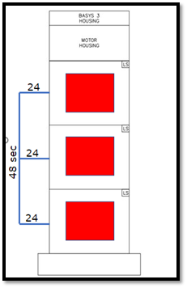
 
# Discussion and Conclusions 
For this project, Elijah Berberette served as the programming lead. He was responsible for  creating the VHDL code for the functionality of the elevator. Wesley Hudson served as the team’s  electrical lead. Essentially, he was tasked with finding how the BASYS3 would interact with each of the  hardware components and how to provide enough power to the system. Because we only had two team  members, many of the tasks that we were on were very intertwined. This meant that even though we had  designated tasks and focuses, many of the accomplishments came from working together. We used peer  coding to develop the necessary elevator functionality iteratively. We used proper communication for  determining which components to use. Lastly, before wiring the system, we spent time working together  to understand why the system would work when each of the components is connected.  
In conclusion, the team was able to accomplish all four revised features defined at the beginning  of the project; however, we did have a few shortcomings. First, the visual appearance of our elevator was  subpar. This is because the structure and appearance were not a huge concern for us during the  development process. Instead, we focused more on creating functionality inside a simple elevator. Next,  we planned to implement a queue system upon many other additional features. We decided that perfecting  the initial functionality was an absolute concern. This prevented us from having time available to  implement many of the additional features that were anticipated. Even with several hurdles and 
unexpected failures, we were able to produce a proof-of-concept visualization of a small scall, three-story elevator. 
# References 

[1] https://lastminuteengineers.com/28byj48-stepper-motor-arduino-tutorial/. (n.d.).  

[2] K, Sam. “Basys 3 Reference Manual.” Basys 3 Reference Manual - Digilent Reference,  digilent.com/reference/programmable-logic/basys-3/reference-manual?redirect=1 

[3] ULN2003 Motor Driver IC. Components101. (n.d.). Retrieved December 2, 2021, from  https://components101.com/ics/stepper-motor-driver-ic-uln2003-pinout-datasheet. 

[4] ULN2003 stepper motor drivers - electronicos caldas. (n.d.). Retrieved December 2, 2021,  from https://www.electronicoscaldas.com/datasheet/ULN2003A-PCB.pdf.  

[5] ULN2003A Symlink - Texas Instruments. (n.d.). Retrieved December 2, 2021, from  https://www.ti.com/lit/ds/symlink/uln2003a.pdf.  

# Appendix A: Software 
(Note: All of the code can be found at https://github.com/elidberb/3FloorElevator )  
This appendix serves as a location for the code described throughout the design details section  of the paper. First, the reader will find the code used to control each of the anodes on the 7-segment  displays. This code is very similar to code used in previous labs and allows us to show the values for informing the user what is occurring inside the elevator. Figure 2 illustrates the code used to output  specific values (0-F) to the 7-Segment display. Figure 3-5 shows the code that controls the state  machine. It set controls the output to the motor, which turns it off and on, as well as send the  information for what floor the elevator is on, and 

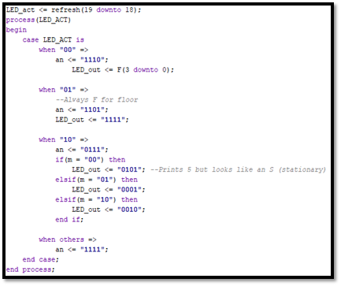

Figure 1. Anode Control

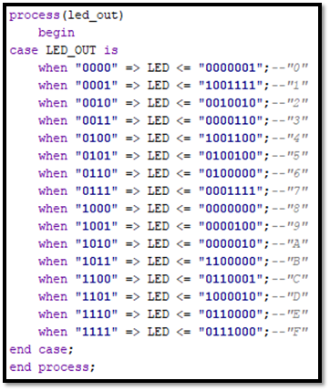

Figure 2. List of 7-Segment Signals

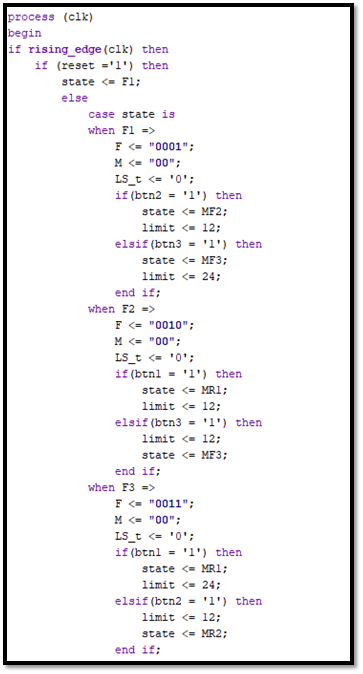

Figure 3. Elevator State Machine - F1-F3

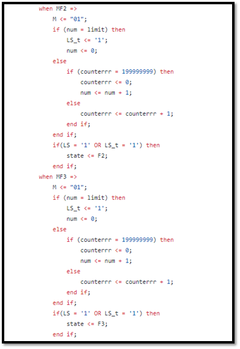

Figure 4. Elevator State Machine - Motor Controls

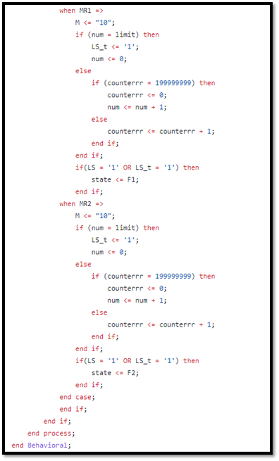

Figure 5. Elevator State Machine - Motor Controls 

This section of the code is used as a component in the top module and controls the digital  outputs for the stepper motor. Figure 6 shows where we declare an instance of the CDiv component,  which is set to output a clock signal at 95 Hz. This is used to drive the process, shown in Figure 6-7, which outputs the signal to the motor driver. The motor driver operates off 4 pins which will output a  “on” signals with a certain pattern. This pattern can drive the motor in either a clockwise or a counterclockwise rotation this is dependent on the M variable (“01” for clockwise and “10” for  counterclockwise.

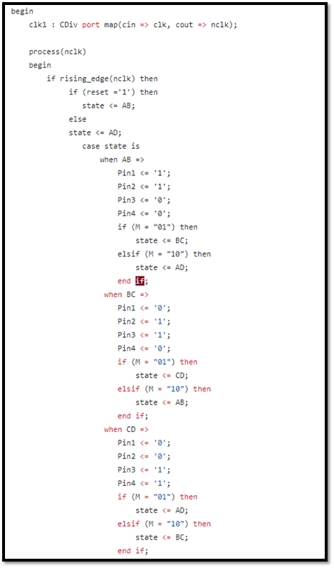

Figure 6. Motor Control State Machine

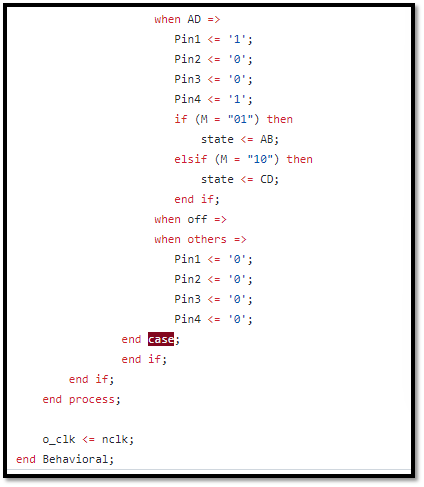

Figure 7. Motor Control State Machine

# Appendix B: Hardware 

This appendix serves as a location for many of the hardware components that are described  throughout the design details section of the paper. Figure 8 shows the wiring connections that are made  between the Basys 3, Arduino, motor driver, and stepper motor. The Basys 3 uses digital outputs to send  a (3.3V, 0V) signal, which is received as a “1” and “0” respectively. The Arduino is being used as a power  source to supply 5V DC power to the motor driver because the stepper motor operates at 5-12 V, so the  Basys 3 could not power it. The motor driver acts as the logic control for the stepper motor. It will  receive the digital control signals from the Basys 3 and output the 5V signa it receives from the Arduino  to the stepper motor. 

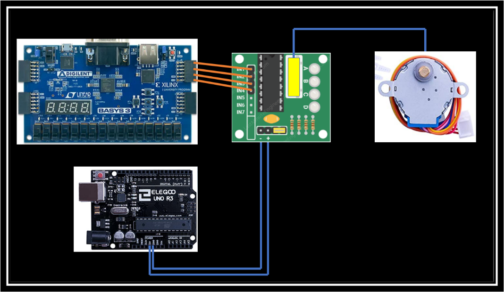
Figure 8: Wiring diagram for the entire system.
